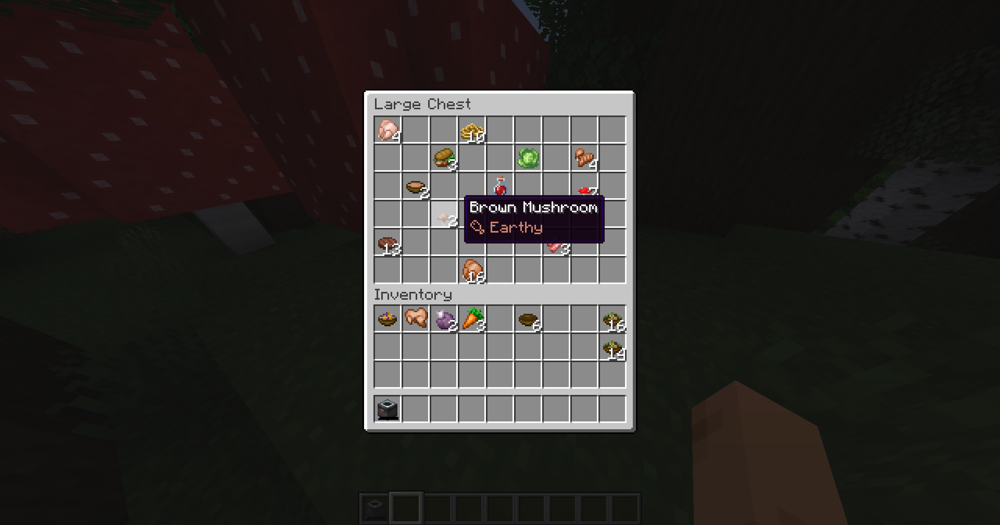
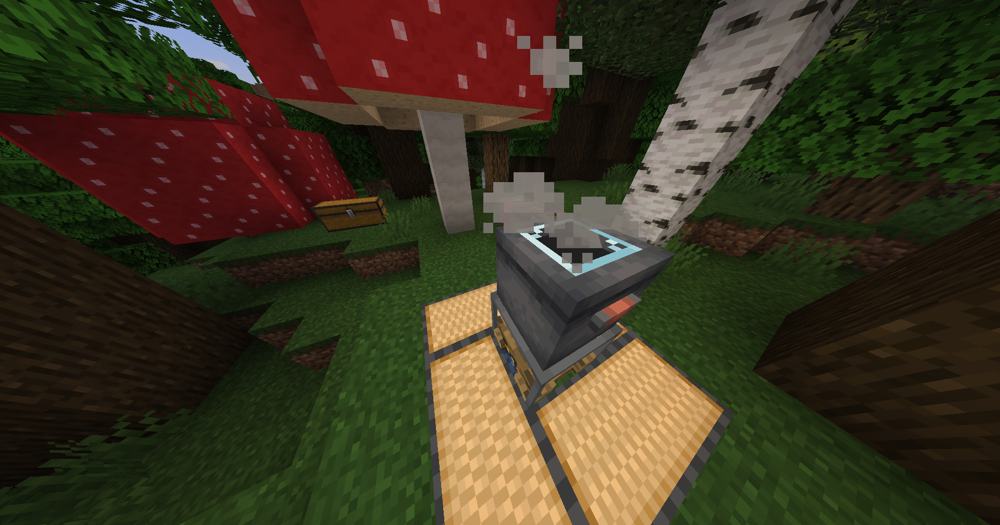
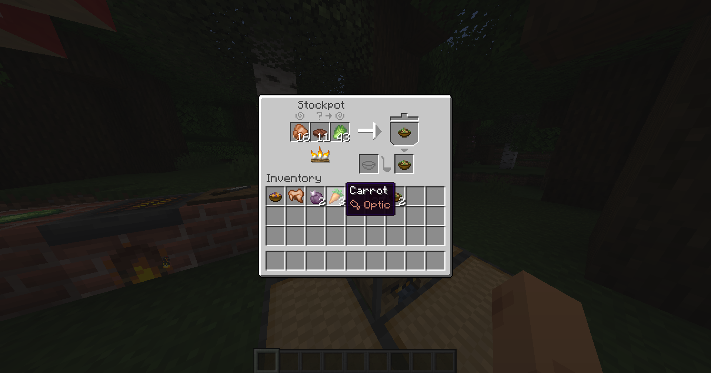
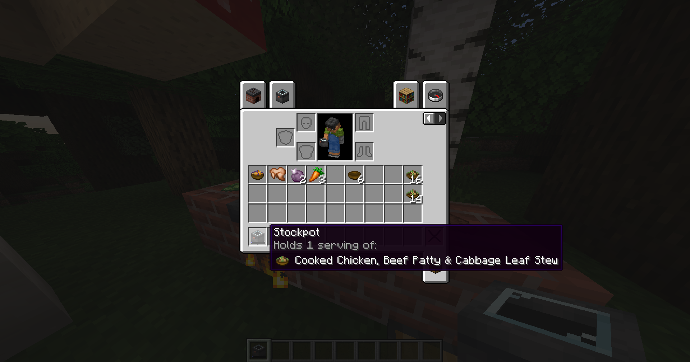
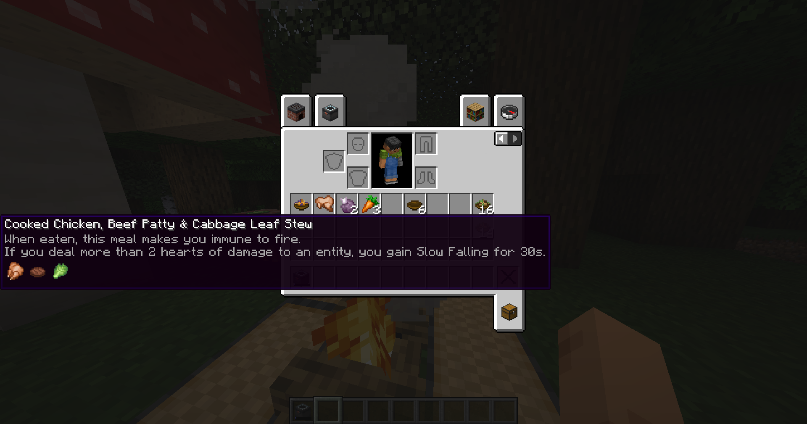
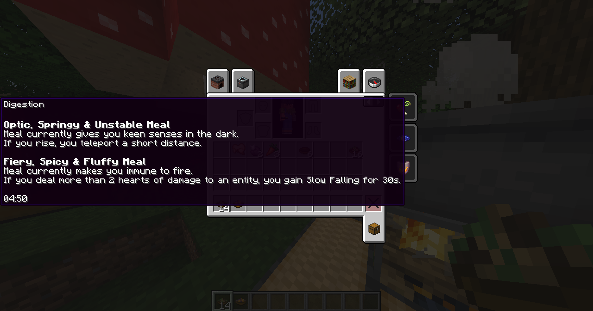

This [Farmer's Delight](https://modrinth.com/mod/farmers-delight) addon **implements a new modular cooking system** into the game.

For now, it only supports the Fabric version, [Farmer's Delight Refabricated](https://modrinth.com/mod/farmers-delight-refabricated) - although I plan to port it to Forge and NeoForge later on.

## How It Works

**Properties** are applied to every "ingredient" item, and determine what that ingredient does when added to a meal. A property can define up to three effects:

- An **ambient** effect - a passive bonus, active the whole time the meal is digesting.
- A **condition** - something you have to do to trigger the meal's activated effect.
- An **activated** effect - what actually happens when the condition is met.



A new block, the **Stockpot**, can be heated to cook meals. Its interface has three input slots, a serving storage slot, a bowl slot, and an output slot. The three input slots correspond to the three property effects - the first slot to the ambient effect, the second to the condition, and the third to the activated effect. Once heated, the ingredients in those three slots combine into a custom meal. Just like the vanilla Cooking Pot, you can only take a serving out with a bowl - otherwise it stays in the pot, even if the pot is broken.





Custom meals get custom names, colors, and models based on the ingredients you add, along with a tooltip showing the exact items used and a description of what the meal does when eaten. Every ingredient also contributes its own hunger (halved), saturation (halved), and any built-in potion effects it carries - including from potions themselves. If the same effect comes from multiple ingredients, their durations stack together, using the highest amplifier among them.



After eating a custom meal, you get the **Digestion** effect. Hovering over it in your inventory shows every currently active meal and what each one does, separated out individually. You can have multiple different meals active at once — but eating a meal with the exact same three ingredients as one you already have active will just refresh its timer rather than stack a second copy.



## Infinite Possibilities!

The mod ships with 16 built-in properties, and even at default settings that adds up to thousands of functionally unique meals. But that's just the starting point - like the [Origins](https://modrinth.com/mod/origins) mod, every part of this system is fully datapack-driven, so anyone can add, remove, or reshape properties without touching a line of code.

### Making Your Own Property

Properties live at `data/<namespace>/modular_delight/properties/<id>.json`. Here's a complete example:

```json
{
  "name": "Juicy",
  "ambient": {
    "attribute": {
      "id": "minecraft:generic.movement_speed",
      "amount": 0.1,
      "operation": "multiply_total",
      "description_divisor": 0.01,
      "description": "grants you +%s%% movement speed"
    }
  },
  "condition": {
    "type": "modulardelight:sprinting",
    "multiplier": 0.5,
    "cooldown_ticks": 200
  },
  "activated": {
    "action": {
      "type": "modulardelight:status_effect",
      "effect": "minecraft:speed",
      "duration_ticks": 100,
      "scale_amplifier": true
    },
    "description": "gain Speed %s for %ss"
  }
}
```

A few things worth knowing as you get started:

- **`ambient`, `condition`, and `activated` are all optional for component registration** - Leave out the ones you don't want.
- **`ambient` supports multiple effects at once** - stack up several `attributes`, `status_effects`, and `damage_reactions` in one property.
- **Conditions can be combined** with `modulardelight:all_of` / `modulardelight:any_of`, and any condition can be flipped with `"inverted": true`.
- **Activated actions are fully composable** - chain multiple actions with `modulardelight:multi`, branch with `modulardelight:if`/`modulardelight:chance`/`modulardelight:choice`, delay one with `modulardelight:delay`, or drop straight into a raw command with `modulardelight:run_command`. There are more built in options, too.
- To hook a property up to actual items, tag them under `data/<namespace>/tags/items/properties/<property_id>.json` - same pattern vanilla uses for any item tag.
- Want to disable one of the built-in properties entirely? Use your own file at the same path (`data/modulardelight/modular_delight/properties/<id>.json`) with just `{ "remove": true }`.

There's plenty more you can hook into - custom meal name filtering, hardcoded name/model overrides for specific ingredient combos, custom ambient reactions, and the full list of built-in condition and action types. For the complete reference, visit the [GitHub](https://github.com/Wintooo-Mods/ModularDelight), and for help (+ a template datapack), visit the [Discord](https://discord.gg/kTQXkVUysM).